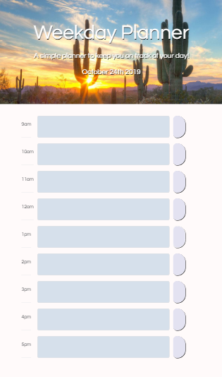
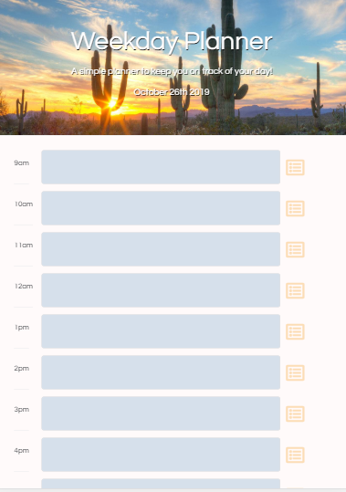
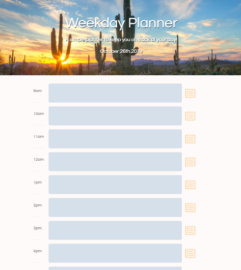

# dayplanner

Description

Time management plays an important role in the life of a Web Developer  professional. As a person with a very busy schedule I decided to build this daily planner to help me keep on track with my daily tasks. It's an application built with HTML, CSS and Jquery . The texts areas change color according to the time of the day.

**Key words**: 
*Planner*
*Bootstrap*,
*Jquery,*
*Object Methods,*
*localStorage,*
*Moment.js*

### Technologies-Libraries
- [Bootstrap](https://getbootstrap.com/) - CSS Framework
- [Jquery](https://jquery.com/) - JavaScript Library 
- [Moment.js](https://momentjs.com/) - JavaScript Library 

### Link
Check it out! 
https://cibellem.github.io/dayplanner/

Screenshots of how the application will look different screens sizes. 

  
  
  

